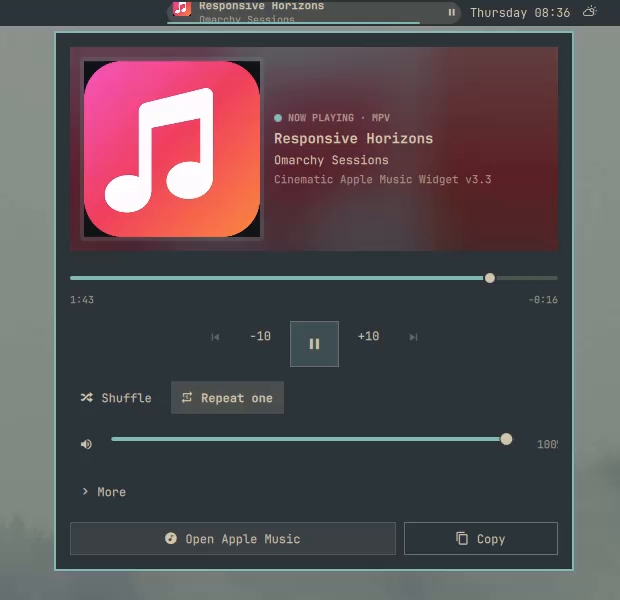

# Apple Music Media for Omarchy

A cinematic, responsive Apple Music bar widget for Omarchy. It controls Apple's official web player through Omarchy's existing MPRIS service, so it needs no MusicKit token, stored Apple credentials, scraping, daemon, or alternate playback backend.



## Features

- Launches or focuses the Apple Music web app
- Artwork, title, artist, progress, seeking, volume, mute, and playback controls
- Full, Title, and Compact bar layouts with an optional progress rail
- Wide, medium, and narrow popup layouts
- Capability-aware shuffle and repeat controls
- Source selection when multiple MPRIS players are available
- Session-only sleep timer with a five-second volume fade
- Optional track-change OSD and private in-memory history
- Artwork-derived accent colors with safe theme fallbacks
- Keyboard navigation and accessible controls
- Shared media state across multiple monitors

## Requirements

- Omarchy 4.0.1 or newer with shell plugin support
- Chromium or another browser supported by `omarchy launch ... webapp`, with Widevine available
- An active Apple Music subscription
- `hyprctl` and GNU `stat` (included with Omarchy)
- Optional: `wl-copy` for Copy Now Playing

## Install

```bash
omarchy plugin add https://github.com/thebenwalther/omarchy-apple-music-media.git --enable
```

The widget defaults to the center bar section. Move it with Omarchy's bar tools if desired.

## Use

- Click the bar widget to open or close the player.
- Scroll the widget to adjust volume, or to change tracks when volume is unavailable.
- Open **More** for the sleep timer, session history, appearance settings, and Omarchy's native Audio Output panel.
- Click **Open Apple Music** to focus an existing Apple Music web-app window or launch one.
- Use `Space`, arrow keys, `Tab`, `Shift+Tab`, and `Escape` for keyboard control.

Apple Music is preferred when the plugin can correlate the web-app window PID with Chromium's MPRIS player. A manually selected playing source remains active until it stops or disappears.

## Update

```bash
omarchy plugin update io.github.thebenwalther.apple-music
```

## Remove

```bash
omarchy plugin remove io.github.thebenwalther.apple-music
```

Removal deletes only the plugin checkout and its bar entry. It does not alter Apple Music's browser session because this plugin does not create or own a browser profile.

## Privacy and security

The plugin runs as unsandboxed user code inside `omarchy-shell`, like every Omarchy shell plugin. Review the source before installing it.

It:

- reads Omarchy's existing MPRIS model and `hyprctl clients -j` to identify the Apple Music web app;
- sends playback controls only through the selected MPRIS player;
- launches Apple's official web player through Omarchy's focus-or-launch command;
- keeps sleep timers and track history only in shell-process memory;
- writes appearance preferences only when you change them in the plugin UI;
- optionally passes sanitized Now Playing text to `wl-copy`;
- accepts artwork only from Chromium's owner-private temporary artwork file pattern, checks an 8 MiB encoded-size ceiling before loading it, and caps decoded image dimensions;
- renders MPRIS-controlled metadata as bounded plain text.

It does not use `sudo`, install services, create a browser profile, read browser credentials, persist track history, or contact an API of its own.

## Development

```bash
bun test
omarchy plugin validate .
```

For live development, install a local checkout:

```bash
omarchy plugin add ~/Work/github.com/thebenwalther/omarchy-apple-music-media --enable
```

## License

MIT. This independent community project is not affiliated with, endorsed by, or sponsored by Apple Inc. Apple Music is a trademark of Apple Inc.
